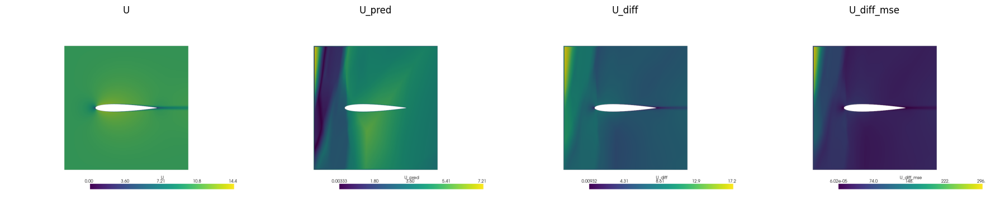
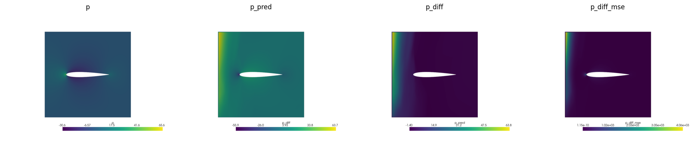

# OpenFOAMPINN
## Repository Description

This repository contains the results of my research on using PINN and GNN technologies in CFD tasks. Two network architectures were considered - FNN and PFNN - within the DeepXDE library (located in the `notebooks/DeepXDE_PINN.ipynb` directory). There was also an attempt to explore PiDeepONet. Promising results with great potential were achieved using Graph Neural Networks (GNN). All materials for preparation, training, and visualization of results are located in the `GNN` directory. The problem considered was the flow around an airplane wing with an ideal, steady, incompressible gas. If desired, the code can be extended for use with compressible gas (in the case of DeepXDE, additional unknowns need to be added and the system of partial differential equations needs to be updated, and `TimePDE` used instead of `PDE`; in the case of GNN, the initial computational case should be prepared using a compressible solver like `rhoSimpleFoam`, etc.).
The computational cases were prepared using `OpenFOAM`, with the initial geometry being quite intricate, as I prepared the wing profiles in `Blender`. I experimented with NACA series profiles.
Please don't judge strictly. The work is not finished.

## Contents

- `GNN`: Materials on GNN.
- `data`: Notebook for data preparation and training.
  - `NACA0012`: Test and training materials for working with DeepXDE on NACA0012.
  - `NACA2412`: Test and training materials for working with DeepXDE on NACA2412.
- `geometry`: Archive with the geometry used as the bodies for flow simulations (you can generate your own using the `Blender/make_naca.blend` file if desired).
- `notebooks`: Jupyter Notebooks for working with FNN/PFNN + a template for working with PiDeepONet.
- `results`: The best results were achieved using GNN, though the model is undertrained.

## Intermediate Results

